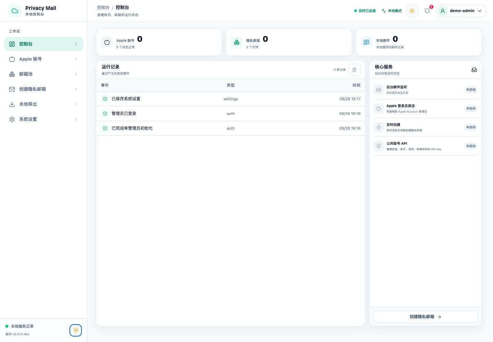
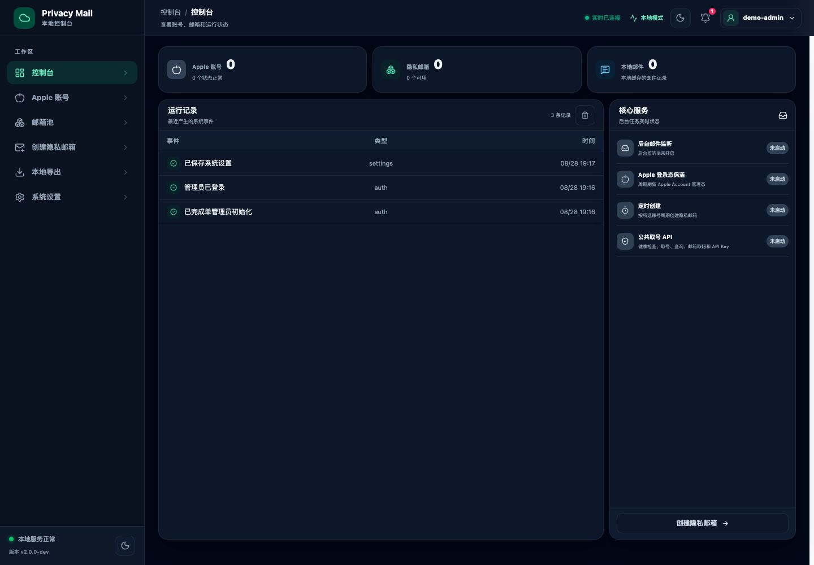
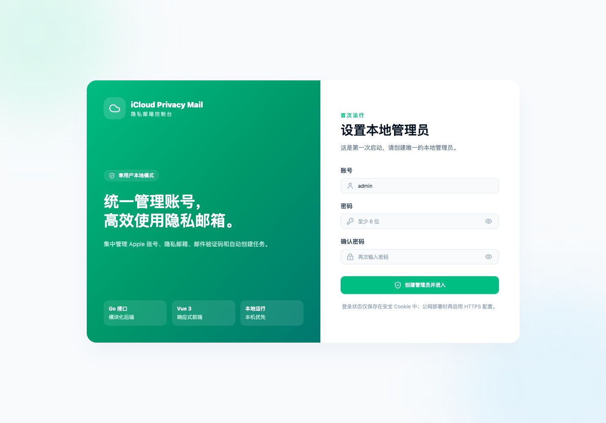
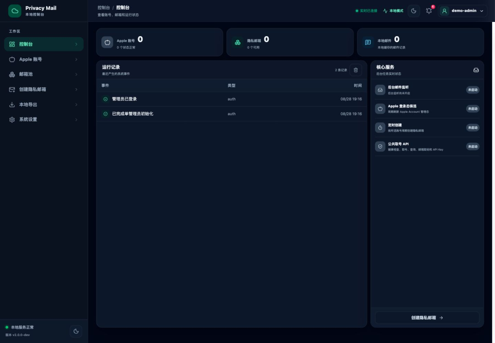
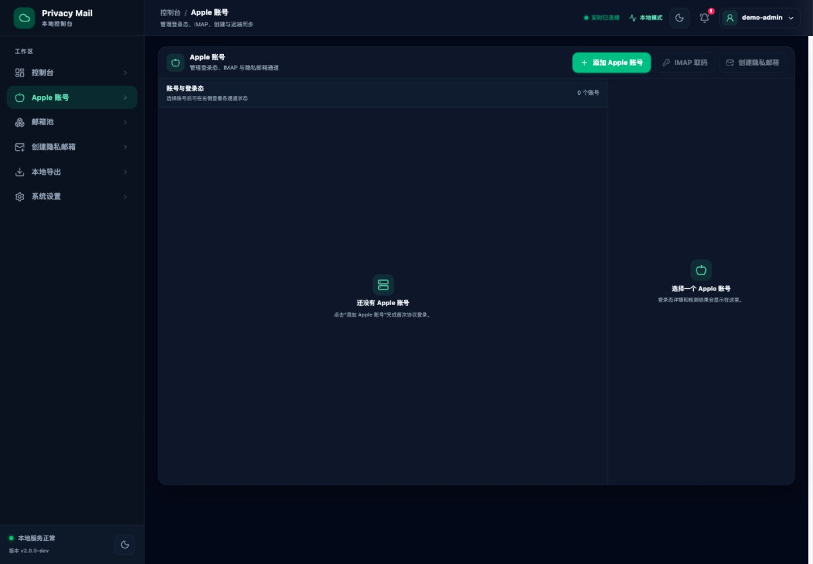
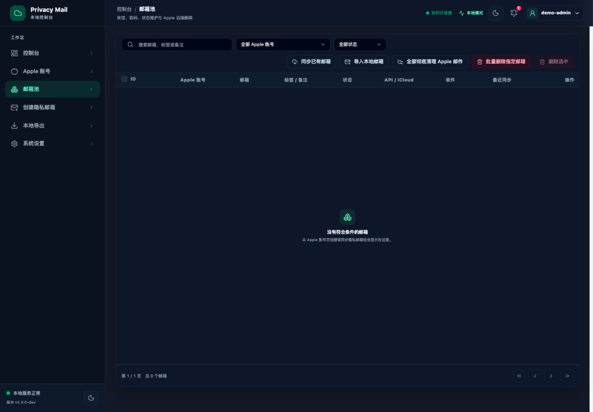
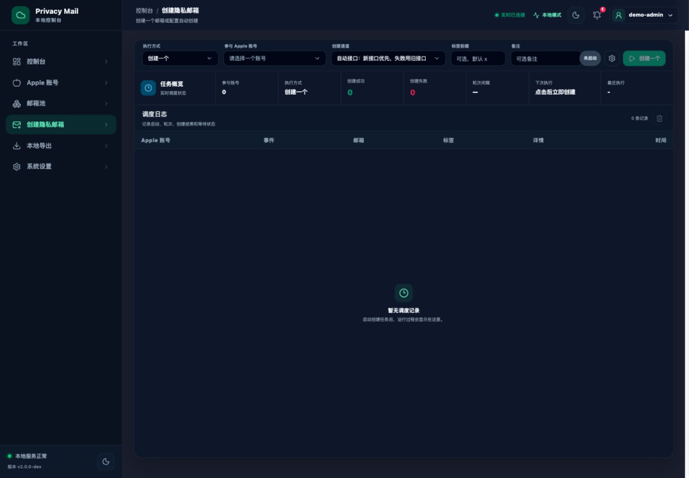
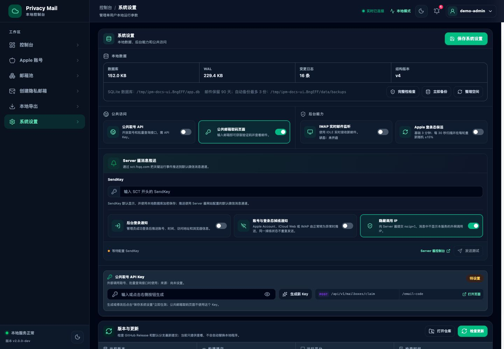
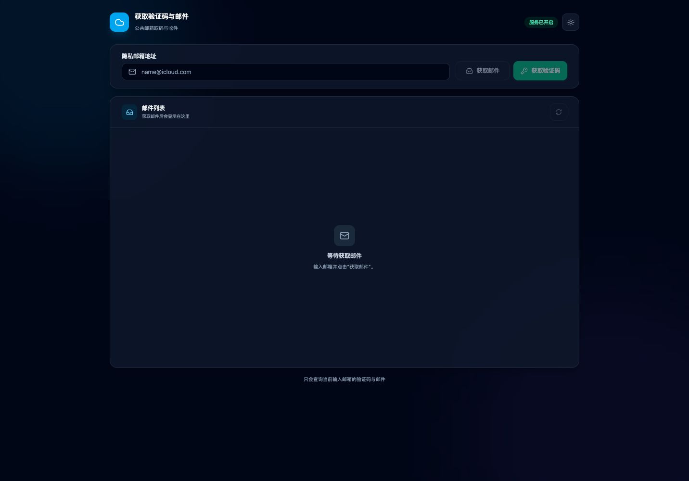

# iCloud Privacy Mail

本地运行的 Apple 隐私邮箱管理工具。后端使用 Go，前端使用 Vue 3，账号、邮箱、邮件、任务和系统设置统一保存在 SQLite。

## 环境要求

- Go 1.25 或更高版本
- Node.js 20.19+ 或 22.12+
- npm

## 快速启动

首次运行先复制配置文件：

```bash
cp config.example.json config.json
```

直接启动：

```bash
go run . -config config.json
```

打开：

```text
http://127.0.0.1:8788/
```

首次打开会要求创建本地管理员，项目没有默认账号或密码。

## 构建

一键构建前端和 Go 服务：

```bash
./scripts/build.sh
```

构建产物：

```text
bin/ipm-server
```

启动构建产物：

```bash
./bin/ipm-server -config config.json
```

只重新构建前端并同步到 Go 嵌入目录：

```bash
npm --prefix frontend ci
npm --prefix frontend run build
./scripts/sync-web.sh
```

## 开发模式

```bash
./scripts/dev.sh
```

- 前端：http://127.0.0.1:5174/
- 后端：http://127.0.0.1:8788/

## 测试

```bash
go test ./...
go vet ./...
npm --prefix frontend run build
```

## 服务器部署

需要与其他网站共存时，推荐使用独立子域名（例如 `mail.example.com`）并让 Nginx/Caddy 反向代理到本机 `127.0.0.1:8788`。Docker Compose、Nginx 和 systemd 模板位于 [`deploy/`](./deploy/)，详细步骤见 [`deploy/README.md`](./deploy/README.md)。

## 常用配置

配置文件默认为 `config.json`，完整字段可参考 `config.example.json`。

| 配置 | 说明 |
| --- | --- |
| `host` / `port` | 服务监听地址和端口 |
| `data_path` | SQLite 数据库路径 |
| `secure_cookie` | HTTPS 部署时启用安全 Cookie |
| `api_key` | 公共取号 API Key |
| `database_backup_dir` | SQLite 备份目录 |
| `database_backup_retention_count` | 自动或手动备份后最多保留的份数，默认 3 |
| `server_chan_send_key` | Server 酱 SendKey |

SQLite 主数据库和密钥文件必须成对保留：

```text
data/app.db
data/app.db.key
```

服务启动 1 分钟后执行首轮自动备份，此后每 24 小时备份一次。系统设置页也可以点击“立即备份”。每次备份后默认只保留最新 3 份 `.db` 和 `.db.key` 文件。

## 版本与公告

系统设置的更新检查读取 [`internal/updatecheck/announcements.json`](./internal/updatecheck/announcements.json)，并通过 GitHub REST API 比较默认分支最新提交 SHA。发布新版本时更新 `latest`；普通提交也会在当前版本号不变时显示更新提示。程序只提示，不会让运行中的进程覆盖自身；服务器确认更新后请按 [`deploy/README.md`](./deploy/README.md) 执行 `deploy/update-server.sh`。

```json
{
  "schema_version": 1,
  "latest": {
    "version": "2.1.2",
    "name": "2.1.2 源码版",
    "notes": "新增 iCloud Web API 分场景开关，请重新下载最新源代码并按文档重新构建",
    "published_at": "2026-08-29T22:30:00+08:00",
    "url": "https://github.com/1173887665/iCloud-Privacy-Mail-v2/archive/refs/heads/main.zip"
  },
  "announcements": []
}
```

## 主题模式

### 亮色模式



### 深色模式



## 页面

### 登录



### 控制台



### Apple 账号



### 邮箱池



### 创建隐私邮箱



### 系统设置



### 公共邮箱取码



## 页面路由

| 路由 | 页面 |
| --- | --- |
| `/login` | 管理员登录 |
| `/` | 控制台 |
| `/apple-accounts` | Apple 账号与登录态 |
| `/mailboxes` | 邮箱池与邮件取码 |
| `/tasks` | 隐私邮箱创建任务 |
| `/settings` | 系统设置、数据库维护与消息推送 |
| `/email-code` | 公共邮箱取码页面 |

## 项目结构

```text
├── main.go                 Go 服务入口
├── config.example.json     配置示例
├── internal/               后端业务、协议、SQLite 和 HTTP API
├── frontend/               Vue 3 前端
├── scripts/                开发、构建和前端同步脚本
├── docs/screenshots/       页面截图
└── bin/                    本地构建产物
```

## 更新代码后重新运行

如果只修改 Go 代码：

```bash
go run . -config config.json
```

如果修改了 `frontend/src`：

```bash
npm --prefix frontend run build
./scripts/sync-web.sh
go run . -config config.json
```
